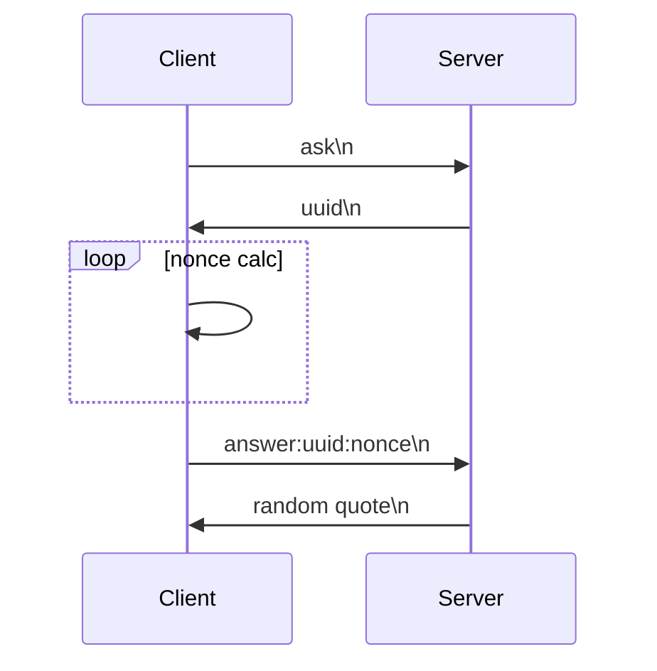

# Proof of work simple example

## Sequence diagram

## Description

1. The client wants to get a quote. It sends an "ask" message
2. The server generates a uuid, stores it in the internal storage with a timestamp and sends it to the client.
3. The client tries to find a nonce for this uuid which is suitable for pow algorithm.
4. The client sends answer to the server with uuid and nonce
5. The server checks:
   - if this uuid exists in internal storage;
   - if it has already been used;
   - if it has expired;
   - if it a suitable nonce,
6. If all is ok server sends quote to the client.

## PoW algorithm

For this task I took a [Hashcash algorithm](https://en.wikipedia.org/wiki/Hashcash) used by Bitcoin.

The main reason: it was interesting for me personally)

## Commands

1. Run tests:  
    `make test`

2. Start client - server interaction in docker:

    `docker-run`

    and loot at you terminal.

## Notes

1. This example uses hardcoded 24 target bits for Hashcash algorithm.
2. If client can't find a proper nonce it fails in 10 seconds
3. Every task expires on 2 seconds

## Sources

1. For this task I used a [habr article](https://habr.com/ru/post/348672/)